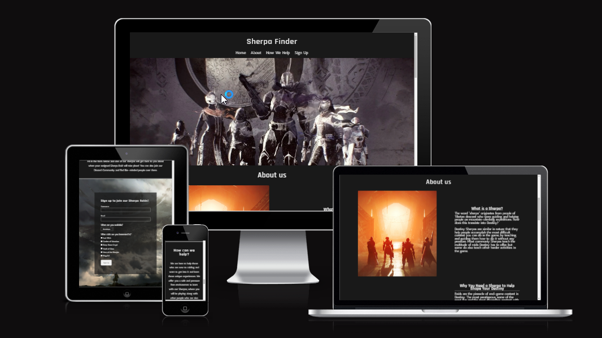
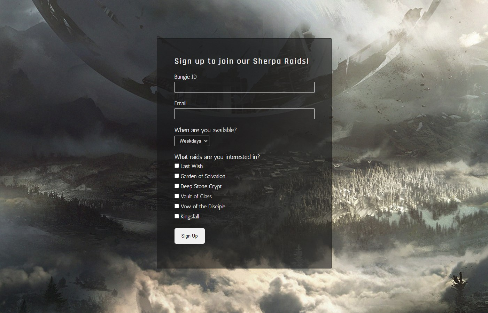
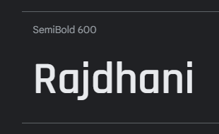
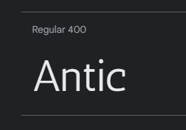

# Sherpa Finder

Sherpa Finder is a fictional website targeting both new and existing players in the video game Destiny who want to get help getting into and learning Raid content in the game. The website gives information about what we do, why we do it, how we help and a sign up form to let the players interested in getting our help to contact us.

It's one single scrollable website that has been designed to be responsive and usable on a wide range of devices and resolutions.

[Sherpa Finder - Live Link](https://hakesh.github.io/p1-sherpa-finder/index.html) (Right click to open in a new tab)

---

## CONTENTS

* [Features](#features)
  * [Existing Features](#existing-features)
  * [Future Implementations](#future-implementations)
  * [Accessibility](#accessibility)

* [Typography](#typography)

* [Technologies Used](#technologies-used)
  * [Languages Used](#languages-used)
  * [Frameworks, Libraries & Programs Used](#frameworks-libraries--programs-used)

* [Deployment](#deployment)

* [Testing](#testing)

* [Credits](#credits)

---

## Features

### Navigation Bar
  - Featured at the top of the page, it's fully responsive on all resolutions and links to the Logo, Home Page, 'About Us' section, 'How We Help' section and to the Sign Up form.
  - The Navigation Bar will help the user to find whichever section they are looking for across all screen resolutions and devices.

### Landing Page Image [IMAGE HERE] 
  - The Landing Page introduces the users to Sherpa Finder with a beautiful image of Guardians (what players are called in-game) standing together in unity as a team.
  - 

### About Us
  - The 'About Us' section gives an introduction to what sherpa means if they are not famililar with the term and how it translates into Destiny, and what sherpas usually do in the game.
  - It also describes why we exist, why we are needed and should encourage the users to contact us if they find them self in the situtations that are mentioned.

### How We Help [IMAGE HERE]
  - Gives the users a clear idea what we offer to them with our service and how to get it.
  - Encourage the user to join our communities or various social platforms to either get help from us or meet people in similar situatins as them, and give them a place to connect.

### Sign Up
  - This section allows the user to get involved and sign up to get help and join our Sherpas in getting to know, learning an doing the raids in a safe environment
  - The user will be able to specify which type of day suits them the best, and let us know which raid or raids they are interested in doing with us.

### Footer
  - Social media icons with link re-directing users to our social media platforms

I then like to add a screenshot of each page of the site here, i use [amiresponsive](https://ui.dev/amiresponsive) which allows me to grab an image of the site as it would be displayed on mobile, tablet and desktop, this helps to show the responsiveness of the site.

### Future Implementations

- A fixed header for easier/better access to the navigation of the website.
- A 'Meet the Team' page with various pictures of the fictional Sherpas the website offers to help players.
- Making my own page where the 'Sign Up' form would take you once registering instead of using the Code Institute formdump.

### Accessibility

I've tried to make the website as accessible as possible where I could by:

- Using semantic HTML.
- Using alt and aria-labels to describe the websites images and icons for screen readers.

## Typography

Google Fonts was used for these fonts:

- **Rajdhani** for all website headings.

- **Antic** for all website body text / paragraphs and the navigation bar.

## Technologies Used

### Languages Used

HTML and CSS was used when making this website.

### Frameworks, Libraries & Programs Used

- Git - For version control.

- GitHub - To save and store the files.

- Google Fonts - To find and import fonts used for the website.

- Font Awesome - To find and import icons used for the websites footer.

- Microsoft Edge Developer Tools - To troubleshoot, test features see and solve responsiveness, also to try get an understand why or how things were working.

- [Am I Responsive](https://ui.dev/amiresponsive) - To show the website on a wide range of devices.

## Deployment

Github Pages was used to deploy the website. The instructions to achieve this can be found below:

1. Log in or sign up to Github.
2. Find the repository for this project, [p1-sherpa-finder](https://github.com/Hakesh/p1-sherpa-finder).
3. Click on the "Settings" button in the menu bar.
4. Click on Pages in the left hand side navigation bar.
5. From the Source dropdown menu, select "Deploy from a branch".
6. From the Branch dropdown menus, select "main" and "/root" respectively.
7. Click Save. Your live Github Pages site is now deployed at the URL shown at the top of the page. **Keep in mind it might take a bit before the page is deployed and a URL is shown, you might have to refresh the page after a few minutes to get it to show.**

The live link can be found here - https://hakesh.github.io/p1-sherpa-finder/index.html

## Testing

This website was developed using Microsft Edge with theuse of Microsoft Edge Dev Tools,which have been used since the very beginning to troubleshoot this website for any problems that arose and to make sure the website was responsive on many different resolutions and devices. 

The website has also been tested in Google Chrome and it works as expected.

The only major issue when developing this website was trying to make the 'About Us' section work and look good. I tried a lot of different methods to make it look like it does now and while it looked good and worked fine on desktop resolutions, it became problematic once I had to make it responsive on medium to small devices. Thankfully i discovered flexbox and it solved this issue altogether.

### Validator Testing

- HTML
  - No errors were returned when passing through the official [W3C Validator.](https://validator.w3.org/nu/?doc=https%3A%2F%2Fhakesh.github.io%2Fp1-sherpa-finder%2Findex.html)

- CSS
  - No errors were found when passing through the official [(Jigsaw) Validator.](https://jigsaw.w3.org/css-validator/validator?lang=en&profile=css3svg&uri=https%3A%2F%2Fhakesh.github.io%2Fp1-sherpa-finder%2Findex.html&usermedium=all&vextwarning=&warning=1)

### Lighthouse Testing

[IMAGE HERE]

### Unfixed Bugs

- Unable to make it required to select at least 1 checkbox in the sign up form. From my research you are unable to do this without the use of JavaScript which I don't know much about yet.

## Credits

- All of the text content was written by myself. This website might be fictional, but Destiny Sherpas are a real thing in the game and my texts were written based on my own experiences, inspiritations and beliefs of what makes a 'sherpa'.

- [Code Institute Template](https://github.com/Code-Institute-Org/gitpod-full-template)
  - My repository was created using the GitPod template given by Code Institute.

- [Wallpaper Abyss](https://wall.alphacoders.com/)
  - Great resource for all kinds of wallpapers. This is where i found the background image for the sign up form. Exact source can be found in the code of style.css

- [W3schools](https://www.w3schools.com/)
  - I didn't use any specific code snippet from them but they are such an incredible resource for learning that I feel i need to include them here as their explenation and examples can help by an incredible amount when trying to understand something!

- [Web Dev Simplified](https://www.youtube.com/c/WebDevSimplified)
  - Thanks to his [video](https://www.youtube.com/watch?v=fYq5PXgSsbE) on learning flexbox in 15 minutes he saved me a lot of time and frustration from trying to make my "About" section of the website work and look the way I wanted it to, which also made it very easy to make it responsive on all devices.

- [Bungie](https://www.bungie.net/)
  - For providing excellent images in their press-kits and articles on their website and for allowing their content to be used in non-commercial creations. The landing page image and both 'About Us' images were taken from their websites. Exact sources can be found in the code of index.html and style.css.

- [Font Awesome](https://fontawesome.com/)
  - Used for the Youtube, Discord and Reddit icon in the footer.

- [Google Fonts](https://fonts.google.com/)
  - Used for finding and using the fonts 'Antic' and 'Rajdhani'.

- The Love Running Project
  - Got a lot of the inspiration of my website from this project, specifically the header, hero-image and sign up form. A lot of the things I learned following along that project is used here as well.